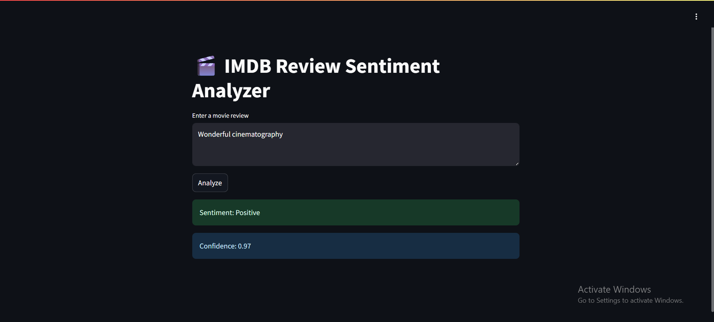

🎯 Sentiment Analysis App

A simple sentiment analysis web application built using a machine learning model trained on IMDB movie reviews. The app classifies input text as **positive** or **negative** sentiment.

---

📦 Features

- Pretrained logistic regression model using `TF-IDF` vectorizer
- Trained on the **IMDB Dataset of 50K reviews**
- User-friendly frontend via **Streamlit**
- Local execution without internet required
- Clean and modular code

---

🧪 Demo



---

🚀 How to Run

1. **Clone the repo:**

```bash
git clone https://github.com/yourusername/sentiment-analysis-app.git
cd sentiment-analysis-app

Create and activate a virtual environment:
python -m venv venv
source venv/bin/activate  # or venv\Scripts\activate on Windows

Install dependencies:
pip install -r requirements.txt

Run the app locally:
streamlit run app.py

📁 Project Structure
.
├── app.py                # Streamlit web app
├── model.py              # Code used to train and export the model
├── sentiment_model.pkl   # Trained ML model
├── vectorizer.pkl        # Fitted TF-IDF vectorizer
├── requirements.txt      # Python dependencies
├── .gitignore
├── LICENSE
└── README.md

✅ Note: Dataset (IMDB Dataset.csv) and model training code are excluded from deployment for size and reproducibility reasons.

🧠 Model Training
Preprocessing: Lowercasing, removing HTML tags, punctuation, and stopwords

Vectorization: TF-IDF using sklearn

Model: Logistic Regression

Training was done in Google Colab and the model was exported as .pkl files

📄 License
This project is licensed under the MIT License - see the LICENSE file for details.

✨ Author
Aneesha Nigam
B.Tech CSE Student | Passionate about AI & Deployment
🔗 LinkedIn : https://www.linkedin.com/in/aneesha-nigam/

